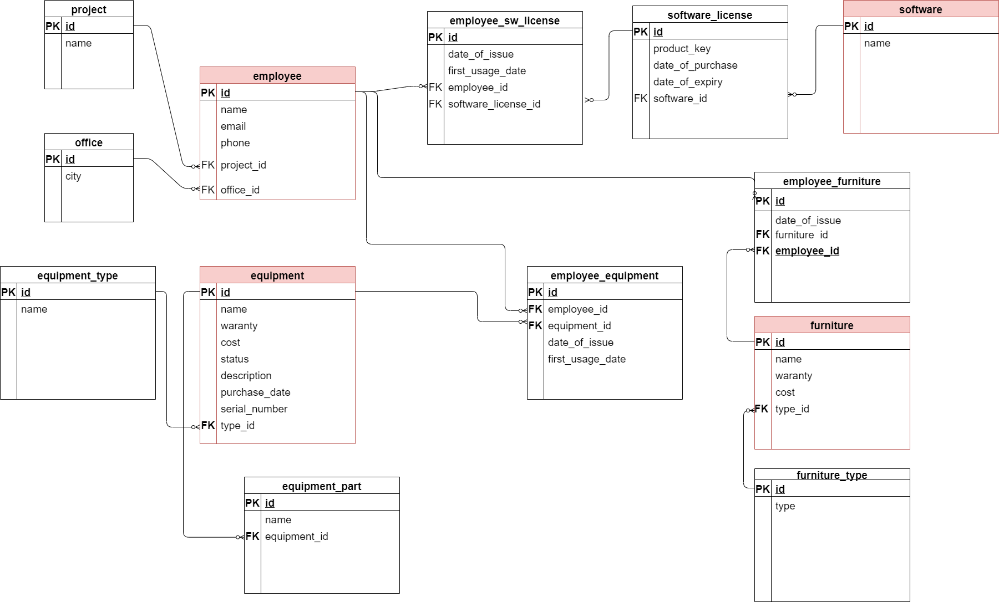

# Description of database structure

## Table software consist of:

var name | type    | constraints | description
-------- | ------- | ----------- | -----------------------
**id**   | PK, INT | NOT NULL    | stores id of software
**name** | TEXT    | NOT NULL    | stores name of software

## Table software_license consist of:

var name             | type    | constraints | description
-------------------- | ------- | ----------- | ------------------------------------------
**id**               | PK, INT | NOT NULL    | stores id of a software license
**software_id**      | FK, INT | NOT NULL    | refers to the table software
**product_key**      | TEXT    | UNIQUE      | stores product key of software
**date_of_purchase** | DATE    | NOT NULL    | stores info when the license was purchased
**date_of_expiry**   | DATE    | NOT NULL    | stores the expiration date of the license

## Table employee_sw_license consist of:

var name                | type    | constraints | description
----------------------- | ------- | ----------- | --------------------------------------
**id**                  | PK, INT | NOT NULL    | stores id of employee software license
**employee_id**         | FK, INT | NOT NULL    | refers to the table employee
**software_license_id** | FK, INT | NOT NULL    | refers to the table software_license
**date_of_issue**       | DATE    | NOT NULL    | stores info when license was issued
**date_of_return**       | DATE    | NULL | stores info when license was returned

## Table furniture consist of:

var name     | type    | constraints             | description
------------ | ------- | ----------------------- | ----------------------------------
**id**       | PK, INT | NOT NULL                | stores id of furniture
**type_id**  | FK, INT | NOT NULL                | refers to the table furniture_type
**name**     | TEXT    | NOT NULL                | stores name of furniture
**warranty** | INT     | NOT NULL, REAL (months) | stores duration of warranty
**cost**     | MONEY | REAL, (UAH)             | stores cost of furniture

## Table furniture_type consist of:

var name | type     | constraints | description
-------- | -------- | ----------- | -------------------------------------------
**id**   | PK, INT  | NOT NULL    | stores id of furniture types
**type** | TEXT    | UNIQUE      | stores info of different types of furniture

## Table employee_furniture consist of:

var name          | type    | constraints | description
----------------- | ------- | ----------- | -------------------------------------
**id**            | PK, INT | NOT NULL    | stores id of employee furniture
**furniture_id**  | FK, INT | NOT NULL    | refers to the table furniture
**employee_id**   | FK, INT | NOT NULL    | refers to the table employee
**date_of_issue** | DATE    | NOT NULL    | stores info when furniture was issued

## Table employee consist of:

var name       | type        | constraints | description
-------------- | ----------- | ----------- | ------------------------------------
**id**         | PK, INT     | NOT NULL    | stores id of a employee
**office_id**  | FK, INT     | NOT NULL    | refers to the table office
**project_id** | FK, INT     | NOT NULL    | refers to the table project
**name**       | CHAR(65)    | NOT NULL    | stores the full name of the employee
**email**      | CHAR(65)    | UNIQUE      | stores employee email
**phone**      | VARCHAR(15) | UNIQUE      | stores employee phone number

## Table equipment consist of:

var name              | type          | constraints                                  | description
--------------------- | ------------- | -------------------------------------------- | ------------------------------------------------
**id**                | PK, INT       | NOT NULL                                     | stores id of a employee
**equipment_type_id** | FK, INT       | NOT NULL                                     | refers to the table equipment_type
**name**              | CHAR(255) | NOT NULL                                     | stores the name of the equipment
**warranty**          | INT           | NOT NULL, REAL(months)                       | stores duration of warranty
**cost**              | MONEY      | REAL, (UAH)                                  | stores equipment cost
**status**            | CHAR(65)      | LIST (issued, on reserve, in repair, broken) | stores information about the status of equipment
**description**       | CHAR(255)     | CHECK (Lenght<255 )                          | stores additional information about equipment
**purhase_date**      | DATE          | NOT NULL                                     | stores date of purchase
**serial_number**     | VARCHAR(65) | NOT NULL                                     | stores serial number of equipment

## Table project consist of:

var name | type     | constraints | description
-------- | -------- | ----------- | ------------------------------
**id**   | PK, INT  | NOT NULL    | stores id of a project
**name** | CHAR(65) | NOT NULL    | stores the name of the project

## Table office consist of:

var name | type      | constraints | description
-------- | --------- | ----------- | -----------------------------
**id**   | PK, INT   | NOT NULL    | stores id of a office
**name** | CHAR(255) | NOT NULL    | stores the name of the office

## Table equipment_type consist of:

var name | type      | constraints | description
-------- | --------- | ----------- | -------------------------------------
**id**   | PK, INT   | NOT NULL    | stores id of a equipment type
**name** | CHAR(255) | UNIQUE      | stores the name of the equipment type

## Table equipment_part consist of:

var name         | type      | constraints | description
---------------- | --------- | ----------- | -------------------------------------
**id**           | PK, INT   | NOT NULL    | stores id of a equipment part
**equipment_id** | FK, INT   | NOT NULL    | refers to the table equipment
**name**         | CHAR(255) | NOT NULL    | stores the name of the equipment part

## Table employee_equipment consist of:

var name          | type    | constraints | description
----------------- | ------- | ----------- | ---------------------------------------
**id**            | PK, INT | NOT NULL    | stores id of a employee_equipment
**employee_id**   | FK, INT | NOT NULL    | refers to the table employee
**equipment_id**  | FK, INT | NOT NULL    | refers to the table equipment
**date_of_issue** | DATE    | NOT NULL    | stores info when equipment was issued
**date_of_return** | DATE    | NULL | stores info when equipment was returned
