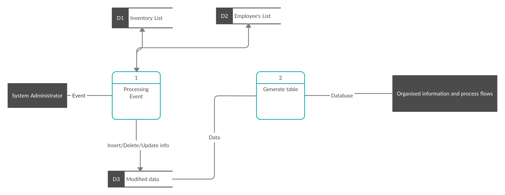

# SOFTWARE REQUIREMENTS SPECIFICATION

## Prepared by

### [Mykyta Kyt](https://github.com/NikitaKit1998) | [Alex Zhytnyk](https://github.com/Alex-ty1)

1. [Introduction](https://github.com/NikitaKit1998/datakyt/blob/srs/docs/srs.md#1-introduction)

  - 1.1 [Purpose](https://github.com/NikitaKit1998/datakyt/blob/srs/docs/srs.md#11-purpose)
  - 1.2 [References](https://github.com/NikitaKit1998/datakyt/blob/srs/docs/srs.md#12-references)

2. [Overall Description](https://github.com/NikitaKit1998/datakyt/blob/srs/docs/srs.md#2-overall-description)

  - 2.1 [Product perspective](https://github.com/NikitaKit1998/datakyt/blob/srs/docs/srs.md#21-product-perspective)
  - 2.2 [Product features](https://github.com/NikitaKit1998/datakyt/blob/srs/docs/srs.md#22-product-features)
  - 2.3 [Operating environment](https://github.com/NikitaKit1998/datakyt/blob/srs/docs/srs.md#23-operating-environment)
  - 2.4 [Design and implementation constraints](https://github.com/NikitaKit1998/datakyt/blob/srs/docs/srs.md#24-design-and-implementation-constraints)

3. [System features](https://github.com/NikitaKit1998/datakyt/blob/srs/docs/srs.md#3-system-features)

  - 3.1 [Description and priority](https://github.com/NikitaKit1998/datakyt/blob/srs/docs/srs.md#31-description-and-priority)

4. [External interface requirements](https://github.com/NikitaKit1998/datakyt/blob/srs/docs/srs.md#4-external-interface-requirements)

  - 4.1 [User Interfaces](https://github.com/NikitaKit1998/datakyt/blob/srs/docs/srs.md#41-user-interfaces)
  - 4.2 [Hardware Interfaces](https://github.com/NikitaKit1998/datakyt/blob/srs/docs/srs.md#42-hardware-interfaces)

5. [Non functional requirements](https://github.com/NikitaKit1998/datakyt/blob/srs/docs/srs.md#5-non-functional-requirements)

  - 5.1 [Software quality attributes](https://github.com/NikitaKit1998/datakyt/blob/srs/docs/srs.md#51-software-quality-attributes)
  - 5.2 [Security requirements](https://github.com/NikitaKit1998/datakyt/blob/srs/docs/srs.md#52-security-requirements)

## 1\. Introduction

### 1.1 Purpose

The purpose of this document is to describe the equipment and employee's accounting system in the company. Of itself, it will represent a database to which you can connect through the web client. The database will have a lot of features such as auto back-up, export to .csv or .xls files, create reports, create new fields, delete and update them. It will be possible to generate inventory labels, which means qr codes. The database will contain all the information about employees and equipment. This product will be able to organize everything and make life easier.

### 1.2 References

1. <https://www.wikiwand.com/en/Flask_(web_framework)> : Flask is a python based lightweight web application framework.
2. <https://www.postgresql.org/> : PostgreSQL is a powerful, open source object-relational database system.
3. <https://pypi.org/project/qrcode/>: Python's library for generating unique qr code for each device.
4. <https://cutt.ly/zf7MkUX> : This article is an explanation of how to connect PostgreSQL with Flask.
5. <https://hydra.cc/docs/intro/> : Hydra is an open-source Python framework that simplifies the development of research and other complex applications.

## 2\. Overall Description

### 2.1 Product perspective

An accounting database system stores the following information.

- **Equipment details:** It includes information about the equipment, such as laptops, monitors, mice, keyboards, headphones, which are issued to employees, as well as information about the equipment that is needed in other cities.
- **Employee description:** It includes the employee's id, first name, last name, position, mail, phone number, city, project.
- **Description of interaction:** It includes information which technique is given to each employee or information that the employee works on his technique. It also includes information about the workplace.
- **Description of equipment status:** it includes information about the equipment that needs to be repaired or replaced by a new one.
- **Software descriptions:** It includes information about the software, such as product key, quantity, expiration date, cost, date of purchase and who owns .

  ### 2.2 Product features

This item presents the DFD-diagram, which shows the general cooperation in the system. They are presented in pictures 1.1-1.2 

Picture 1.1 - DFD diagram A-0 level.

Picture 1.2 - DFD diagram A0 level.

### 2.3 Operating environment

This product will work in any browser, as it will represent a web page. On PostgreSQL 9.5, Python 3.8\. This database will be located on Amazon AWS servers.

### 2.4 Design and implementation constraints

Our constraints are:

- Possibilities of Python programming language and PostgreSQL DBMS;
- Writing Python code that satisfies PEP 8;
- Constraints that may be imposed by the project business logic such as:

  - The ability to have multiple owners for one piece of equipment/furniture
  - The database is operated in two modes: full access and partial (read-only) access, etc.

  ## 3\. System features

  ### 3.1 Description and priority

- **Import/Export** to .csv file/ .xls file: saving or uploading tables.

- **Generating QR codes** with unique inventory number: unique number on the inventory, which will make it easier to count and keep records

- **Back up**: Saving the database before entering and changing information.

- **Data Structuring**: all information in a digital repository is organized into a clear hierarchical structure with records, tables or objects.

- **Multi-user Access**: provides multiple users access to all types of information stored in one and the same data store.

- **Add/Remove** information about employees or equipment in the database.

- **Reporting tools**: necessary data query
- **Inventory Monitoring**: the activity of checking stock.

## 4\. External interface requirements

In my opinion, the application will intercommunicate directly through the web page with users. That is, to enter the site, login is required. Depending on the level of access (ordinary user or administrator -- this means that there will be an account for the admin and the ordinary user), the user continues to perform various operations, such as adding/removing employees or technicians, creating reports on the number of technicians or employees.

### 4.1 User interfaces

- Front - end software: Python 3.8 version
- Back - end software: PostgreSQL 9.5 version

### 4.2 Hardware interfaces

- a browser

## 5\. Non functional requirements

### 5.1 Software quality attributes

For any system that is implemented in the software, several checks must be performed to minimize subsequent errors in its usage. In our case we have used the following checks to detect errors:

1. **Displaying information** - check the matching of fields in the form of user interface with similar fields inside the database.
2. **Data safety and integrity** - all the information, as well as its modification, should be displayed identically.
3. **Update table record** - the updated information corresponds to the block type.
4. **Performance Check** - to verify that the software is working under load. Not the largest request should not be processed for 5 minutes.

Database check allows reducing risks, which, one way or another, are related to the integrity of information, the ability of the architecture to respond to the load before the period of software implementation into full operation.

### 5.2 Security requirements

А password will be used in this database to access the information required during the work process. This applies to viewing the information as well as changing it. This measure is necessary to preserve the integrity of information and confidentiality of personal information about employees.
